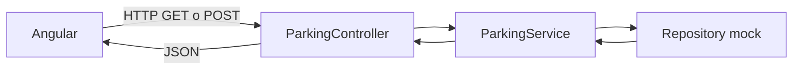

# Contexto del backend de SmartPark

## 1. Objetivo del proyecto

SmartPark es un aplicativo para administrar los parqueaderos de conjuntos residenciales. El backend expone una API REST que puede ser consumida por el frontend desarrollado en Angular.

En esta primera etapa no existe una base de datos. Por eso, los datos se encuentran definidos en memoria como mocks. La API mantiene las mismas responsabilidades y rutas que tendria una implementacion conectada a PostgreSQL, de forma que el frontend pueda avanzar desde ahora.

## 2. Tecnologias utilizadas

- **Kotlin**: lenguaje principal del backend.
- **Spring Boot**: framework para crear la aplicacion web y la API REST.
- **Spring Web**: permite crear controladores con rutas HTTP.
- **Jackson Kotlin**: convierte objetos Kotlin a JSON y JSON a objetos Kotlin.
- **Maven**: administra dependencias y ejecuta la compilacion.
- **Java 17**: version utilizada para ejecutar el proyecto.

La clase principal de la aplicacion es `SmartParkApplication`. Spring Boot busca automaticamente los componentes anotados con `@Service`, `@Repository`, `@RestController` y `@Configuration`.

## 3. Como esta organizado

```text
Back/
  pom.xml
  README.md
  BACKEND_CONTEXT.md
  src/main/kotlin/co/smartpark/
    SmartParkApplication.kt
    config/
      WebConfig.kt
    domain/
      ParkingModels.kt
    repository/
      MockRepositories.kt
    service/
      ParkingService.kt
    web/
      ParkingController.kt
    src/main/resources/
      application.properties
```

### `domain`

Contiene los modelos del negocio. Estos modelos representan los objetos que viajan en las respuestas JSON o que llegan en las solicitudes del frontend.

Incluye:

- `ResidentialComplex`: conjunto residencial.
- `Resident`: residente y su apartamento.
- `Vehicle`: vehiculo registrado por un residente.
- `ParkingSpace`: espacio fisico del parqueadero.
- `Reservation`: reserva de un espacio.
- `CreateReservationRequest`: datos necesarios para crear una reserva.
- `DashboardSummary`: indicadores resumidos del parqueadero.

Tambien contiene los estados validos:

- `ParkingSpaceStatus`: `AVAILABLE`, `OCCUPIED`, `RESERVED`, `MAINTENANCE`.
- `VehicleType`: `CAR`, `MOTORCYCLE`, `BICYCLE`.
- `ReservationStatus`: `PENDING`, `ACTIVE`, `COMPLETED`, `CANCELLED`.

### `repository`

Contiene el acceso a los datos. Actualmente las clases tienen listas internas con datos quemados.

Por ejemplo, `ComplexRepository` devuelve los conjuntos definidos en una lista y `ReservationRepository` permite consultar o agregar reservas en memoria.

Esta capa es importante porque aisla el origen de los datos. En el futuro se pueden reemplazar estas clases por repositorios JPA conectados a PostgreSQL sin tener que cambiar las rutas del controlador.

### `service`

`ParkingService` contiene las reglas de negocio y coordina los repositorios.

Sus responsabilidades actuales son:

- Consultar conjuntos, residentes, vehiculos, espacios y reservas.
- Aplicar filtros recibidos por query parameters.
- Validar que existan las entidades relacionadas al crear una reserva.
- Validar que `endsAt` sea posterior a `startsAt`.
- Construir el resumen del dashboard.
- Devolver errores HTTP cuando un recurso no existe.

El controlador no accede directamente a los repositorios. Siempre pasa por el servicio, lo que facilita agregar reglas de negocio posteriormente.

### `web`

`ParkingController` define las rutas HTTP publicas. Su prefijo general es:

```text
/api/v1
```

La version en la URL permite crear una futura `/api/v2` sin romper inmediatamente el frontend actual.

### `config`

`WebConfig` configura CORS para permitir que Angular, ejecutandose en `http://localhost:4200`, consuma la API que corre en `http://localhost:8080`.

## 4. Flujo de una solicitud



Ejemplo para consultar los espacios disponibles:

1. Angular envia `GET /api/v1/parking-spaces?complexId=1&status=AVAILABLE`.
2. `ParkingController` recibe los parametros.
3. `ParkingService` solicita los datos a `ParkingSpaceRepository`.
4. El repositorio filtra la lista en memoria.
5. Spring convierte la lista de objetos Kotlin a JSON.
6. Angular recibe la respuesta.

## 5. Rutas disponibles

Todas las rutas empiezan con `/api/v1`.

| Metodo | Ruta | Descripcion |
| --- | --- | --- |
| GET | `/complexes` | Lista todos los conjuntos residenciales. |
| GET | `/complexes/{id}` | Consulta un conjunto por su identificador. |
| GET | `/residents` | Lista todos los residentes. |
| GET | `/residents?complexId=1` | Filtra residentes por conjunto. |
| GET | `/vehicles` | Lista todos los vehiculos. |
| GET | `/vehicles?complexId=1&residentId=1` | Filtra vehiculos por conjunto o residente. |
| GET | `/parking-spaces` | Lista espacios de parqueadero. |
| GET | `/parking-spaces?complexId=1&status=AVAILABLE` | Filtra espacios por conjunto y estado. |
| GET | `/reservations` | Lista reservas. |
| GET | `/reservations?complexId=1&status=ACTIVE` | Filtra reservas por conjunto y estado. |
| POST | `/reservations` | Crea una reserva en memoria. |
| GET | `/dashboard/summary?complexId=1` | Devuelve indicadores del conjunto. |

## 6. Ejemplos de consumo

### Consultar conjuntos

```bash
curl http://localhost:8080/api/v1/complexes
```

Respuesta aproximada:

```json
[
  {
    "id": 1,
    "name": "Conjunto Los Cedros",
    "address": "Carrera 15 # 102-20",
    "totalParkingSpaces": 36
  }
]
```

### Consultar espacios disponibles

```bash
curl "http://localhost:8080/api/v1/parking-spaces?complexId=1&status=AVAILABLE"
```

Los valores de `status` deben coincidir con el enum `ParkingSpaceStatus`, por ejemplo `AVAILABLE`, `OCCUPIED` o `RESERVED`.

### Crear una reserva

```bash
curl -X POST http://localhost:8080/api/v1/reservations \
  -H "Content-Type: application/json" \
  -d '{
    "parkingSpaceId": 1,
    "vehicleId": 1,
    "residentId": 1,
    "complexId": 1,
    "startsAt": "2026-09-24T18:00:00",
    "endsAt": "2026-09-24T20:00:00"
  }'
```

La respuesta contiene la reserva creada con un nuevo `id` y estado `PENDING`.

Desde Angular, el consumo equivalente puede hacerse con `HttpClient`:

```typescript
this.http.get<ParkingSpace[]>(
  'http://localhost:8080/api/v1/parking-spaces',
  { params: { complexId: 1, status: 'AVAILABLE' } }
);
```

## 7. Validaciones y errores

Al crear una reserva, el servicio valida:

- Que exista el conjunto.
- Que exista el espacio de parqueadero.
- Que exista el vehiculo.
- Que exista el residente.
- Que `endsAt` sea posterior a `startsAt`.

Respuestas de error esperadas:

- `404 Not Found`: no se encuentra el conjunto, espacio, vehiculo o residente solicitado.
- `400 Bad Request`: las fechas de la reserva son invalidas.

## 8. Como ejecutar el backend

Desde la carpeta `Back`:

```bash
mvn test
mvn spring-boot:run
```

La API queda disponible en:

```text
http://localhost:8080
```

El frontend Angular, por defecto, se ejecuta en:

```text
http://localhost:4200
```

## 9. Como pasar de mocks a PostgreSQL

La migracion recomendada es gradual:

1. Crear el esquema de base de datos para conjuntos, residentes, vehiculos, espacios y reservas.
2. Agregar las dependencias de Spring Data JPA y el driver de PostgreSQL en `pom.xml`.
3. Convertir los modelos persistentes en entidades JPA o crear entidades separadas de los DTOs.
4. Crear interfaces como `JpaRepository` para cada recurso.
5. Reemplazar la logica de las clases mock por consultas a los repositorios JPA.
6. Mantener `ParkingService` y `ParkingController` con las mismas rutas y contratos JSON siempre que sea posible.
7. Agregar migraciones con Flyway o Liquibase.
8. Mover la configuracion de conexion a variables de entorno y perfiles de Spring.

La idea central es que el frontend no tenga que saber si los datos vienen de una lista en memoria o de PostgreSQL.

## 10. Limitaciones actuales del mock

Este backend es una base para desarrollo del frontend, no una implementacion productiva. Actualmente:

- Los datos se reinician cada vez que se reinicia la aplicacion.
- Las reservas nuevas solo viven en memoria.
- No hay autenticacion ni autorizacion por roles.
- No se valida que el vehiculo y el residente pertenezcan al mismo conjunto.
- No se valida que dos reservas tengan horarios cruzados.
- No se actualiza automaticamente el estado de un espacio al crear una reserva.
- No hay paginacion, auditoria ni persistencia.

Estas reglas deben completarse antes de conectar el sistema a usuarios reales.

## 11. Resumen para explicar el proyecto

> SmartPark tiene una API REST construida con Spring Boot y Kotlin. La API esta versionada bajo `/api/v1` y organiza el codigo en modelos de dominio, repositorios, servicios y controladores. Actualmente los repositorios usan datos mock en memoria para permitir que Angular avance sin una base de datos. El servicio concentra las validaciones y reglas de negocio, mientras que el controlador expone rutas estables. Cuando se cree la base de datos, se reemplazaran los repositorios mock por repositorios JPA, conservando en lo posible los mismos endpoints para no afectar el frontend.
